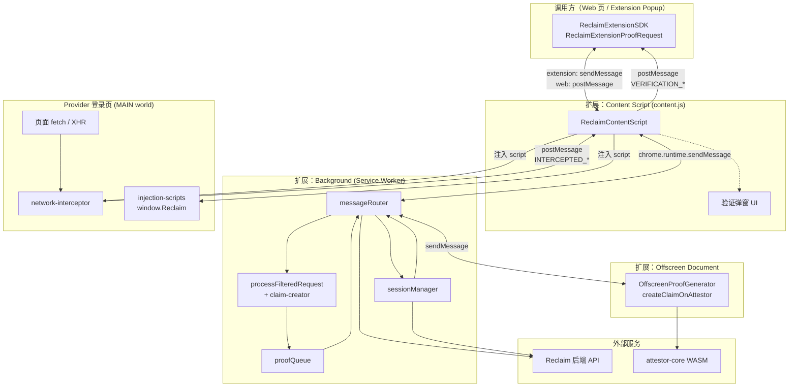
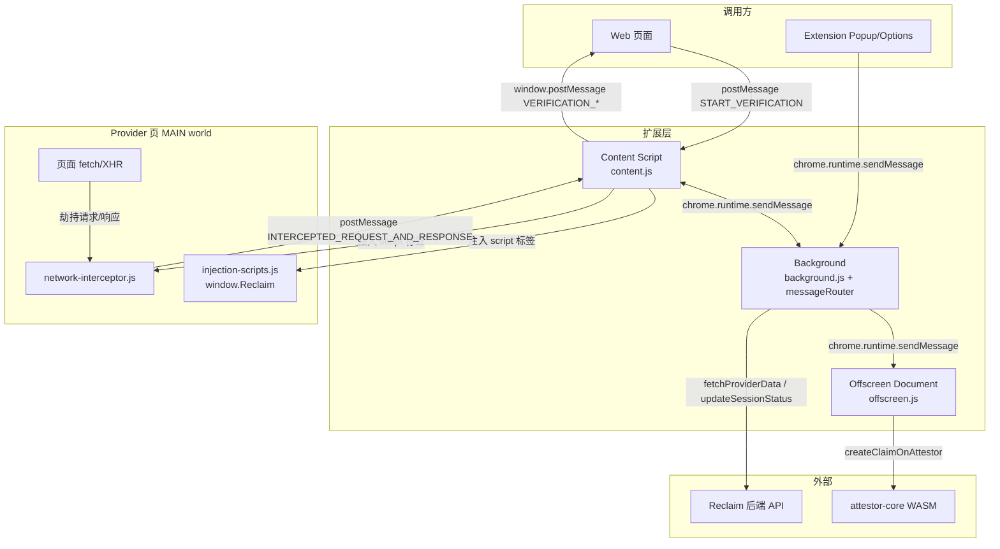
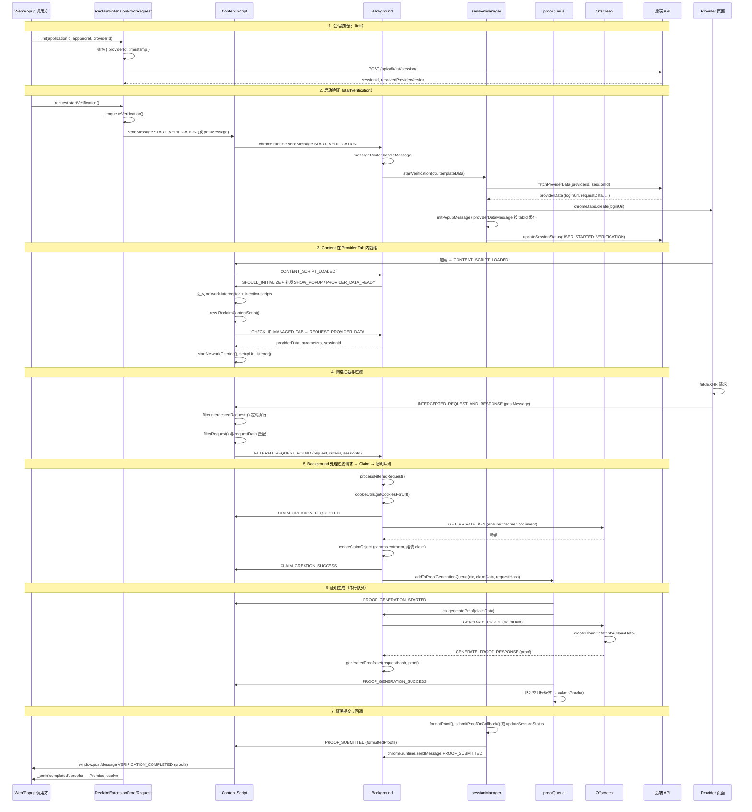
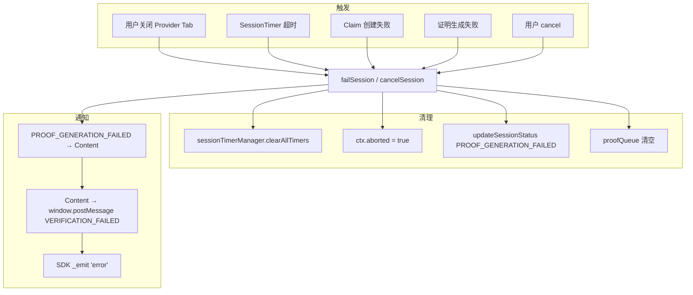

# Reclaim Browser Extension SDK — 核心代码逻辑与流程流转

本文档梳理 `@reclaimprotocol/browser-extension-sdk`（除 `examples` 外）的核心代码逻辑与流程流转，便于理解与二次开发。

---

## 一、概述

SDK 用于在**网页**或**扩展自身 UI（popup/panel）**中触发 Reclaim 验证流程：串联 **Content Script ↔ Background ↔ Offscreen Document**，打开 Provider 登录页、拦截网络请求、生成 ZK 证明并回调完成事件。兼容 Chrome Manifest V3。

**核心能力：**

- 会话初始化（后端 `init/session`、签名）
- 验证启动（拉取 Provider 配置、开新 Tab、展示验证弹窗）
- 网络拦截（Fetch/XHR 注入、请求/响应匹配）
- Claim 创建（参数提取、Cookie、Offscreen 私钥）
- 证明生成（Offscreen + attestor-core + WASM）
- 证明提交（callback URL 或仅更新状态）
- 事件通知（started / completed / error）

---

## 二、整体架构图

下图从运行环境与通信关系角度概括 SDK 的整体架构：**调用方**（Web 页或扩展 Popup）通过 **Content Script** 与 **Background** 协作，在 **Provider 登录页** 中注入 **拦截器** 抓请求，由 **Background** 协调 **Offscreen** 生成证明，并与 **Reclaim 后端** 同步状态。



**图例说明：**

| 层级 | 说明 |
|------|------|
| **调用方** | 使用 SDK 的 Web 页面或扩展 Popup/Options；通过 `init()` + `startVerification()` 发起，通过事件 `completed` / `error` 收结果。 |
| **Content Script** | 注入到「当前 Tab」的扩展脚本；仅在验证 Tab（managedTab）内注入拦截器、拉 providerData、做请求过滤，并转发证明结果到页面。 |
| **Background** | Service Worker；维护会话 ctx、路由消息、拉 Provider、开 Tab、处理过滤请求、组 Claim、排队生成证明、提交回调。 |
| **Offscreen** | 不可见的扩展页面；负责私钥生成与 ZK 证明（createClaimOnAttestor），供 Background 通过 sendMessage 调用。 |
| **Provider 页** | 用户登录的第三方页（如 Google/GitHub）；MAIN world 内运行 network-interceptor（劫持 fetch/XHR）和 injection-scripts（window.Reclaim）。 |
| **外部服务** | Reclaim 后端（会话/状态/Provider 配置）、attestor-core（WASM 证明）。 |

---

## 三、目录与入口

```
src/
├── index.js                    # 仅 re-export ReclaimExtensionSDK
├── ReclaimExtensionSDK.js      # 对外 SDK 单例 + ReclaimExtensionProofRequest 类
├── background/                 # Service Worker 逻辑
│   ├── background.js           # 初始化 ctx、消息入口、Tab 监听
│   ├── messageRouter.js        # 消息分发（START_VERIFICATION、FILTERED_REQUEST_FOUND 等）
│   ├── sessionManager.js       # startVerification / failSession / submitProofs / cancelSession
│   ├── proofQueue.js           # 证明生成队列（串行、暂停/恢复 SessionTimer）
│   ├── tabManager.js            # managedTabs 简单封装(暂时未使用)
│   ├── cookieUtils.js          # 按 URL 获取 Cookie（eTLD+1、分区 Cookie）
├── content/
│   ├── content.js              # Content 主逻辑：注入拦截器、ReclaimContentScript、过滤与转发
│   └── components/
│       └── reclaim-provider-verification-popup.js  # 验证中弹窗 UI
├── interceptor/
│   ├── network-interceptor.js  # 注入到页面 MAIN world：劫持 fetch/XHR，postMessage 请求/响应
│   └── injection-scripts.js    # 注入到页面：Reclaim.* API、动态拉取/执行 Provider 注入脚本
├── offscreen/
│   ├── offscreen.html
│   └── offscreen.js            # OffscreenProofGenerator：GENERATE_PROOF、createClaimOnAttestor
└── utils/
    ├── constants/              # BACKEND_URL、API_ENDPOINTS、RECLAIM_SDK_ACTIONS、MESSAGE_ACTIONS 等
    ├── fetch-calls.js          # fetchProviderData、updateSessionStatus、submitProofOnCallback
    ├── claim-creator/          # createClaimObject、filterRequest（network-filter）、params-extractor
    ├── proof-generator/        # generateProof（发消息给 offscreen）、proof-formatter
    ├── offscreen-manager.js     # ensureOffscreenDocument、OFFSCREEN_DOCUMENT_READY 监听
    ├── session-timer.js        # SessionTimerManager（超时 failSession）
    ├── logger/                 # LoggerService、createContextLogger、LOG_CONFIG_STORAGE_KEY
    └── polyfills.js
```

**构建产物（package.json exports）：**

- 主入口：`ReclaimExtensionSDK.bundle.js`
- 扩展用：`background/background.bundle.js`、`content/content.bundle.js`、`offscreen/offscreen.bundle.js`
- 注入用：`interceptor/network-interceptor.bundle.js`、`interceptor/injection-scripts.bundle.js`

---

## 四、核心模块职责

| 模块                             | 职责                                                                                                                                                                                                                                                                                                                                                                                                                                    |
| -------------------------------- | --------------------------------------------------------------------------------------------------------------------------------------------------------------------------------------------------------------------------------------------------------------------------------------------------------------------------------------------------------------------------------------------------------------------------------------- |
| **ReclaimExtensionSDK.js**       | 单例 SDK：`initializeBackground()`、`init()`/`fromJsonString()`、`isExtensionInstalled()`、`setLogConfig()`。区分 extension / web 模式（`location.protocol === "chrome-extension:"`）。                                                                                                                                                                                                                                                 |
| **ReclaimExtensionProofRequest** | 单次验证请求：`init()` 调后端建会话并签名，`startVerification()` 入队后发 START_VERIFICATION（extension 用 `chrome.runtime.sendMessage`，web 用 `window.postMessage` + extensionID）。监听 `chrome.runtime.onMessage` / `window.message` 得到 PROOF_SUBMITTED / VERIFICATION_COMPLETED 等，驱动 Promise 与事件。                                                                                                                        |
| **background.js**                | 创建全局 `ctx`（providerData、sessionId、proofGenerationQueue、sessionTimerManager 等），注册 `chrome.runtime.onMessage` → `messageRouter.handleMessage`，`tabs.onRemoved` 时若为当前验证 Tab 则 `failSession`。提供 `processFilteredRequest`（Cookie、claim 创建、入证明队列）。                                                                                                                                                       |
| **messageRouter.js**             | 根据 `action` 分发：CONTENT_SCRIPT_LOADED、REQUEST_PROVIDER_DATA、START_VERIFICATION、CANCEL_VERIFICATION、FILTERED_REQUEST_FOUND、REQUEST_CLAIM、INJECT_VIA_SCRIPTING（REPLAY_PAGE_FETCH / RUN_CUSTOM_INJECTION）等，调用 sessionManager / processFilteredRequest / proofQueue。                                                                                                                                                       |
| **sessionManager.js**            | `startVerification`：清空会话状态、`fetchProviderData`、`chrome.tabs.create(loginUrl)`、把 tabId 加入 managedTabs、把 SHOW_PROVIDER_VERIFICATION_POPUP 与 PROVIDER_DATA_READY 放入 Map 待 Content 就绪后发送。`failSession` / `cancelSession`：更新状态、通知 Content / originalTab / runtime。`submitProofs`：formatProof、callback 或仅更新状态、通知各端、关 Tab。                                                                   |
| **proofQueue.js**                | 队列项为 `{ claimData, requestHash }`。`processNextQueueItem`：暂停 SessionTimer、向 Content 发 PROOF_GENERATION_STARTED、调 `ctx.generateProof`（即 proof-generator → offscreen）、成功则写入 `generatedProofs`、发 PROOF_GENERATION_SUCCESS、恢复/清空 Timer，全部完成后触发 `submitProofs`。                                                                                                                                         |
| **content.js**                   | 加载时发 CONTENT*SCRIPT_LOADED；根据 SHOULD_INITIALIZE 决定是否注入 network-interceptor 与 injection-scripts，并 new ReclaimContentScript。ReclaimContentScript：REQUEST_PROVIDER_DATA 拿到 providerData 后 startNetworkFiltering、REPLAY_PAGE_FETCH、customInjection；监听 INTERCEPTED_REQUEST_AND_RESPONSE，过滤后发 FILTERED_REQUEST_FOUND；处理 SHOW_PROVIDER_VERIFICATION_POPUP、PROOF*\* 等，并向 window postMessage 给页面/SDK。 |
| **network-interceptor.js**       | 在页面 MAIN world：RequestInterceptor 代理 fetch、改写 XHR.open/send，response 中间件里把 request+response 通过 `postMessage(INTERCEPTED_REQUEST_AND_RESPONSE)` 发给 Content。                                                                                                                                                                                                                                                          |
| **injection-scripts.js**         | 在页面：挂载 `window.Reclaim`（parameters、updatePublicData、canExpectManyClaims、reportProviderError、requestClaim 等）；从 localStorage 或 postMessage 取 providerId / 注入脚本，拉取或执行 Provider 定制脚本。                                                                                                                                                                                                                       |
| **offscreen.js**                 | OffscreenProofGenerator 监听 GENERATE_PROOF，调 `createClaimOnAttestor(claimData)`（attestor-core），结果通过 GENERATE_PROOF_RESPONSE 回传 Background；GET_PRIVATE_KEY 生成随机私钥并回传（供 claim-creator 用）。                                                                                                                                                                                                                      |
| **claim-creator**                | `createClaimObject`：ensureOffscreenDocument、getPrivateKeyFromOffscreen、getUserLocationBasedOnIp、从 request/response 提取参数（params-extractor）、组装 claim 对象。`filterRequest`（network-filter）：按 urlType/method/bodySniff/responseMatches 判断请求是否匹配 Provider 的 requestData。                                                                                                                                        |
| **proof-generator**              | `generateProof`：ensureOffscreenDocument，然后 `chrome.runtime.sendMessage(GENERATE_PROOF, data)`，监听 GENERATE_PROOF_RESPONSE，resolve/reject 给 Background。                                                                                                                                                                                                                                                                         |
| **offscreen-manager.js**         | 监听 OFFSCREEN_DOCUMENT_READY；`ensureOffscreenDocument`：若无上下文则 `chrome.offscreen.createDocument`，再 waitForOffscreenReady（含 PING_OFFSCREEN）。                                                                                                                                                                                                                                                                               |

---

## 五、主流程：从“开始验证”到“证明回调”

### 4.1 会话初始化（Web/Extension 调用方）

1. 调用方使用 `reclaimExtensionSDK.init(applicationId, appSecret, providerId, options)` 或 `fromJsonString`/`fromConfig`。
2. **ReclaimExtensionProofRequest.init**：
   - 构造 `ReclaimExtensionProofRequest`，对 `{ providerId, timestamp }` 做 keccak256 + Wallet(appSecret).signMessage。
   - `_initSession`：POST `BACKEND_URL/api/sdk/init/session/`，得到 `sessionId`、`resolvedProviderVersion`。
   - 返回实例，调用方可 `setAppCallbackUrl`、`setParams`、`addContext` 等。

### 4.2 启动验证（startVerification）

3. 调用方执行 `request.startVerification()`。
   - 内部先 `_enqueueVerification`（队列串行，避免多会话并发）。
   - **Extension 模式**：`chrome.runtime.sendMessage({ action: "START_VERIFICATION", source: "content-script", target: "background", data: templateData })`。
   - **Web 模式**：`window.postMessage({ action: RECLAIM_SDK_ACTIONS.START_VERIFICATION, messageId, data: templateData, extensionID })`，由已加载的 Content Script 接收并转发给 Background。

4. **Background - messageRouter**：收到 `START_VERIFICATION`（source=content-script, target=background）。
   - 并发校验：若已有 `activeSessionId` 且不等于本次 sessionId 且 managedTabs 非空，则拒绝。
   - 调用 **sessionManager.startVerification(ctx, data)**。

5. **sessionManager.startVerification**：
   - 清空 ctx 上会话相关状态（providerData、sessionId、generatedProofs、filteredRequests 等）。
   - **fetchProviderData**(providerId, sessionId, applicationId) → 拉取 Provider 配置（含 loginUrl、requestData、customInjection 等）。
   - `chrome.tabs.create({ url: providerData.loginUrl })`，得到 tabId；
   - 将 tabId 设为 `ctx.activeTabId` 并加入 `ctx.managedTabs`。
   - 构造 SHOW_PROVIDER_VERIFICATION_POPUP 与 PROVIDER_DATA_READY 消息，放入 `ctx.initPopupMessage`、`ctx.providerDataMessage`（按 tabId），等 Content 在该 Tab 内加载后再发。
   - 调用 **updateSessionStatus**(sessionId, USER_STARTED_VERIFICATION, ...)。
   - 返回 `{ success: true }` 给调用方。

6. Content Script 在**新开的 Provider Tab** 里加载：
   - 先发 **CONTENT_SCRIPT_LOADED**。
   - Background 在 messageRouter 里处理 CONTENT_SCRIPT_LOADED：若该 tabId 在 managedTabs，则发 **SHOULD_INITIALIZE**（shouldInitialize: true），并把 initPopupMessage / providerDataMessage 中待发消息发给该 Tab。
   - Content 收到 SHOULD_INITIALIZE 后：注入 **network-interceptor** 与 **injection-scripts**，并 `new ReclaimContentScript()`。

7. **ReclaimContentScript** 初始化：
   - 发 **CHECK_IF_MANAGED_TAB**，确认后发 **REQUEST_PROVIDER_DATA**。
   - Background 从 ctx 取出 providerData/parameters/sessionId 等，**sendResponse** 回 Content。
   - Content 收到后：保存 providerData、sessionId、parameters，写 localStorage，可选 **INJECT_VIA_SCRIPTING**（REPLAY_PAGE_FETCH）、customInjection（RUN_CUSTOM_INJECTION 或写 localStorage 给 injection-scripts），然后 **startNetworkFiltering()**，并 **setupUrlListener**（URL 变化时再次 REPLAY_PAGE_FETCH）。
   - 若 Background 之前已把 SHOW_PROVIDER_VERIFICATION_POPUP / PROVIDER_DATA_READY 发到该 Tab，Content 会显示验证弹窗并再次进入过滤逻辑。

### 4.3 网络拦截与过滤

8. **network-interceptor**（页面 MAIN world）劫持 fetch 与 XHR，每个请求/响应经中间件后以 `postMessage({ action: "INTERCEPTED_REQUEST_AND_RESPONSE", data: { request, response, timestamp } })` 发给 Content（同源 window）。

9. Content 的 **ReclaimContentScript** 在 **handleMessage**（或 window message 监听）里收到 INTERCEPTED_REQUEST_AND_RESPONSE，把数据存入 `interceptedRequestResponses`，并调用 **startNetworkFiltering()**（若尚未在过滤）。

10. **startNetworkFiltering** 启动定时器，周期性执行 **filterInterceptedRequests**：
    - 遍历 `interceptedRequestResponses`，对每条请求用 **filterRequest**(formattedRequest, criteria, parameters)（claim-creator/network-filter）与 providerData.requestData 做匹配。
    - 若匹配：标记已过滤，**sendFilteredRequestToBackground**(formattedRequest, criteria, loginUrl) → `chrome.runtime.sendMessage(FILTERED_REQUEST_FOUND, { request, criteria, sessionId, loginUrl })`。

### 4.4 Background 处理过滤请求与 Claim

11. **messageRouter** 收到 **FILTERED_REQUEST_FOUND**：
    - 若 ctx.filteredRequests 已存在该 requestHash，直接返回已缓存结果。
    - 否则写入 filteredRequests，并调用 **ctx.processFilteredRequest**(request, criteria, sessionId, loginUrl)。

12. **processFilteredRequest**（在 background.js 中挂到 ctx）：
    - 首次请求时启动 **sessionTimerManager**。
    - **cookieUtils.getCookiesForUrl**(request.url) 得到 Cookie 写入 request。
    - 向 Content 发 **CLAIM_CREATION_REQUESTED**（requestHash）。
    - 调用 **createClaimObject**(request, criteriaWithGeo, sessionId, providerId, loginUrl, bgLogger)：
      - **ensureOffscreenDocument**；
      - **getPrivateKeyFromOffscreen**（GET_PRIVATE_KEY → offscreen 生成私钥并回传）；
      - getUserLocationBasedOnIp（若需要）；
      - 从 request/response 提取参数（params-extractor）；
      - 组装 claim 对象。
    - 若失败：发 CLAIM_CREATION_FAILED，**failSession**。
    - 若成功：发 CLAIM_CREATION_SUCCESS，把 providerRequest 按 requestHash 存入 ctx.providerRequestsByHash，并 **proofQueue.addToProofGenerationQueue(ctx, claimData, requestHash)**。

### 4.5 证明生成队列（proofQueue）

13. **addToProofGenerationQueue** 将 `{ claimData, requestHash }` 推入 `ctx.proofGenerationQueue`，并暂停 SessionTimer，若当前未在处理队列则调用 **processNextQueueItem(ctx)**。

14. **processNextQueueItem**：
    - 若 aborted 或队列空且已收集齐模板请求，则视情况 resumeSessionTimer 或 **submitProofs**，然后 return。
    - 否则取出队首，向 Content 发 **PROOF_GENERATION_STARTED**。
    - 调用 **ctx.generateProof**（即 **proof-generator.generateProof**）：
      - **ensureOffscreenDocument**；
      - **chrome.runtime.sendMessage**({ action: GENERATE_PROOF, target: OFFSCREEN, data: claimData })；
      - 监听 **GENERATE_PROOF_RESPONSE**，resolve({ success, proof }) 或 reject。
    - Offscreen 内 **OffscreenProofGenerator** 收到 GENERATE_PROOF，执行 **createClaimOnAttestor(claimData)**（attestor-core，含 WASM），结果通过 GENERATE_PROOF_RESPONSE 回传。
    - 成功：把 proof 写入 ctx.generatedProofs，发 **PROOF_GENERATION_SUCCESS**，reset SessionTimer。
    - 失败：**failSession**。
    - finally：isProcessingQueue = false，若队列非空继续 processNextQueueItem，否则根据模板是否全部完成决定 **submitProofs** 或 resumeSessionTimer。

### 4.6 证明提交与回调

15. **sessionManager.submitProofs**：
    - 若 ctx.expectManyClaims 为 true 则直接 return（由调用方控制提交时机）。
    - 用 **formatProof** 将 generatedProofs 按 providerData.requestData / providerRequestsByHash 格式化为 finalProofs。
    - 若有 **callbackUrl**：**submitProofOnCallback**(finalProofs, callbackUrl, sessionId, ...)（POST 到 callback，再 updateSessionStatus PROOF_SUBMITTED）；失败则向 Content / originalTab / runtime 发 PROOF_SUBMISSION_FAILED。
    - 若无 callbackUrl：仅 **updateSessionStatus**(PROOF_GENERATION_SUCCESS)。
    - 向 **activeTabId**、**originalTabId** 发 **PROOF_SUBMITTED**（formattedProofs, submitted, sessionId）。
    - **chrome.runtime.sendMessage(PROOF_SUBMITTED)** 广播给 popup/options。
    - 约 3s 后激活 originalTab 并关闭 provider Tab，清空 activeSessionId。

16. Content 收到 **PROOF_SUBMITTED** 后：
    - 若在弹窗：调用 popup 的 handleProofSubmitted。
    - **window.postMessage**({ action: RECLAIM_SDK_ACTIONS.VERIFICATION_COMPLETED, messageId: sessionId, data: { proofs } }, "\*")。

17. 调用方（Extension 或 Web）：
    - **Extension**：ReclaimExtensionProofRequest 的 `chrome.runtime.onMessage` 收到 PROOF_SUBMITTED，触发 `_emit("completed", proofs)`，startVerification 的 Promise resolve。
    - **Web**：页面上的 window 的 message 监听收到 VERIFICATION_COMPLETED，SDK 内部 `_emit("completed", proofs)`，Promise resolve。
    - 若配置了 callbackUrl，服务端也会收到 POST 的 proofs。

---

## 七、消息与动作速查

| Action                                                                    | 方向                           | 说明                                                              |
| ------------------------------------------------------------------------- | ------------------------------ | ----------------------------------------------------------------- |
| START_VERIFICATION                                                        | Content → Background           | 开始验证，携带 templateData                                       |
| CONTENT_SCRIPT_LOADED                                                     | Content → Background           | Content 已加载，Background 回 SHOULD_INITIALIZE 及待发 popup/data |
| REQUEST_PROVIDER_DATA                                                     | Content → Background           | 请求当前会话的 providerData/parameters                            |
| FILTERED_REQUEST_FOUND                                                    | Content → Background           | 匹配到一条请求，触发 processFilteredRequest → claim → proofQueue  |
| CLAIM_CREATION_REQUESTED/SUCCESS/FAILED                                   | Background → Content           | Claim 创建状态，用于弹窗状态                                      |
| PROOF_GENERATION_STARTED/SUCCESS/FAILED                                   | Background → Content           | 证明生成状态                                                      |
| PROOF_SUBMITTED / PROOF_SUBMISSION_FAILED                                 | Background → Content / runtime | 证明已提交或提交失败                                              |
| GENERATE_PROOF                                                            | Background → Offscreen         | 请求生成证明                                                      |
| GENERATE_PROOF_RESPONSE                                                   | Offscreen → Background         | 证明结果                                                          |
| GET_PRIVATE_KEY / GET_PRIVATE_KEY_RESPONSE                                | Background ↔ Offscreen        | 私钥生成（claim 用）                                              |
| RECLAIM_START_VERIFICATION / VERIFICATION_COMPLETED / VERIFICATION_FAILED | 页面 ↔ Content（postMessage） | 页面/SDK 与 Content 桥接                                          |

---

## 八、核心逻辑流转图（Mermaid）

### 8.1 架构与模块关系



### 8.2 主流程时序（从开始验证到证明回调）



### 8.3 消息与数据流简图

```mermaid
flowchart LR
    subgraph 入口
        A[init / startVerification]
    end
    subgraph Content
        B[CONTENT_SCRIPT_LOADED]
        C[REQUEST_PROVIDER_DATA]
        D[SHOW_POPUP / PROVIDER_DATA_READY]
        E[INTERCEPTED_REQUEST_AND_RESPONSE]
        F[filterRequest]
        G[FILTERED_REQUEST_FOUND]
    end
    subgraph Background
        H[messageRouter]
        I[sessionManager.startVerification]
        J[processFilteredRequest]
        K[createClaimObject]
        L[proofQueue]
        M[generateProof → Offscreen]
        N[submitProofs]
    end
    subgraph 出口
        O[PROOF_SUBMITTED]
        P[VERIFICATION_COMPLETED]
    end

    A --> B
    B --> C
    C --> D
    D --> E
    E --> F
    F --> G
    G --> H
    H --> I
    I --> J
    J --> K
    K --> L
    L --> M
    M --> N
    N --> O
    O --> P
```



### 8.4 失败与取消路径



---

## 九、数据流简图（ASCII 备查）

```
[Web / Popup]
    │ init() / startVerification()
    │ postMessage(START_VERIFICATION) 或 chrome.runtime.sendMessage
    ▼
[Content Script]  ←→  [Background]
    │                    │ fetchProviderData / updateSessionStatus
    │                    │ tabs.create(loginUrl)
    │                    │ initPopupMessage / providerDataMessage
    │  SHOW_PROVIDER_VERIFICATION_POPUP, PROVIDER_DATA_READY
    │  REQUEST_PROVIDER_DATA → providerData
    │                    │
    │  inject network-interceptor + injection-scripts (MAIN world)
    │                    │
[Page: fetch/XHR]  →  INTERCEPTED_REQUEST_AND_RESPONSE  →  Content
    │                    │
    │  filterRequest()  →  FILTERED_REQUEST_FOUND  →  Background
    │                    │ processFilteredRequest
    │                    │ createClaimObject (offscreen 私钥、params-extractor)
    │                    │ proofQueue.addToProofGenerationQueue
    │                    │ processNextQueueItem
    │                    │ generateProof → Offscreen (createClaimOnAttestor)
    │                    │ generatedProofs → submitProofs
    │                    │   → submitProofOnCallback / updateSessionStatus
    │                    │   → PROOF_SUBMITTED → Content → window.postMessage(VERIFICATION_COMPLETED)
    ▼
[Web / Popup]  on('completed', proofs)
```

---

## 十、依赖与外部服务

- **后端**：`BACKEND_URL`（默认 https://api.reclaimprotocol.org）
  - `POST /api/sdk/init/session/` 初始化会话
  - `GET /api/providers/:providerId` 拉取 Provider 配置
  - `POST /api/sdk/update/session/` 更新会话状态
  - 证明提交：应用提供的 callbackUrl（POST body 为 URL 编码的 proofs JSON 字符串）
- **attestor-core**：`createClaimOnAttestor(claimData)` 在 Offscreen 中运行，依赖 WASM/TLS 等，用于生成 ZK 证明。
- **ethers**：Wallet、keccak256、getBytes，用于会话签名。

以上即为 Reclaim Browser Extension SDK 的核心代码逻辑与端到端流程梳理；具体方法签名与错误码可结合 `src/utils/constants/interfaces.js` 与各模块源码查阅。
