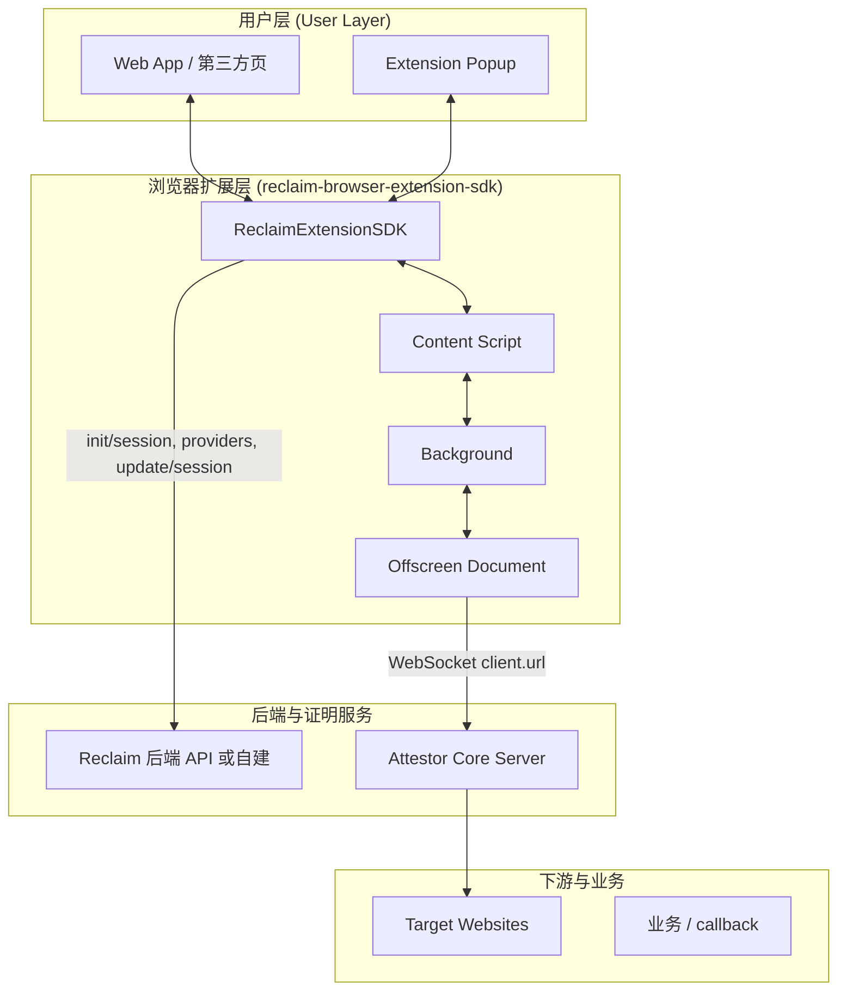

# Reclaim 综合架构与私有化部署指南

> 本文档基于 **reclaim-browser-extension-sdk** 与 **attestor-core** 的**源码**梳理端到端架构与私有化要点，不依赖其他 .md 文档；所有接口、常量、流程以代码为准。

---

## 目录

1. [综合架构图](#1-综合架构图)
2. [数据流与协议关系（代码依据）](#2-数据流与协议关系代码依据)
3. [公有云 vs 私有化差异](#3-公有云-vs-私有化差异)
4. [私有化部署要点（基于代码）](#4-私有化部署要点基于代码)
5. [Extension 侧私有化改造要点](#5-extension-侧私有化改造要点)
6. [代码索引](#6-代码索引)

---

## 1. 综合架构图

### 1.1 端到端分层架构（Mermaid）



### 1.2 扩展内部证明流（与代码一致）

- **Background**（`background.js`）维护 `ctx`，注册 `messageRouter.handleMessage`。
- 请求命中过滤后：Content 发 `FILTERED_REQUEST_FOUND` → Background 的 `processFilteredRequest`（`background.js`）→ `createClaimObject`（`claim-creator.js`）→ `addToProofGenerationQueue`（`proofQueue.js`）。
- **proofQueue**：`processNextQueueItem` 取队首，调用 `ctx.generateProof(claimData)`（`proof-generator.js`）。
- **proof-generator**：`ensureOffscreenDocument` 后向 Offscreen 发 `GENERATE_PROOF`（带 `claimData`），等待 `GENERATE_PROOF_RESPONSE`（60 秒超时）。
- **Offscreen**（`offscreen.js`）：收到 `GENERATE_PROOF` 后调用 `createClaimOnAttestor(claimData)`（来自 `@reclaimprotocol/attestor-core`）。`claimData.client.url` 即 Attestor WebSocket 地址（Extension 中来自 `ATTESTOR_WS_URL`，见 `claim-creator.js`）。
- **attestor-core 客户端**（`create-claim.ts`）：`getAttestorClientFromPool(clientInit.url, ...)` 连接 WS，发 init → createTunnel → TLS 与目标站通信 → claimTunnel，返回签名的 proof。
- **Attestor 服务端**（`attestor-core/src/server`）：`init`、`createTunnel`、`claimTunnel`、`fetchCertificateBytes`、`toprf` 等 RPC（见 `handlers/index.ts`）。

### 1.3 综合架构 ASCII 总览

```
┌─────────────────────────────────────────────────────────────────────────────────────────────┐
│                                    用户层 (User Layer)                                        │
│  Web App (ReclaimDemo 等)  ←→  ReclaimExtensionSDK (init, startVerification)  ←→  Popup       │
└─────────────────────────────────────────────────────────────────────────────────────────────┘
                                                      │
┌─────────────────────────────────────────────────────────────────────────────────────────────┐
│                    浏览器扩展层 (reclaim-browser-extension-sdk)                                │
│  Content Script  ←chrome.runtime→  Background (messageRouter, proofQueue, processFilteredRequest)  │
│       ↑                                    ↓                                                 │
│  network-interceptor              chrome.offscreen  ←→  Offscreen (createClaimOnAttestor)     │
└─────────────────────────────────────────────────────────────────────────────────────────────┘
     │                                    │ HTTP (BACKEND_URL)        │ WebSocket (ATTESTOR_WS_URL)
     │                                    ▼                           ▼
┌─────────────────────────────────────────────────────────────────────────────────────────────┐
│  Reclaim 后端 / 自建  (init/session, providers, update/session, custom-injection)             │
│  Attestor (attestor-core): init, createTunnel, claimTunnel, toprf, fetchCertificateBytes     │
└─────────────────────────────────────────────────────────────────────────────────────────────┘
                                                      │
                              Attestor → Target Websites (TLS)；可选住宅代理 (HTTPS_PROXY_URL)
```

---

## 2. 数据流与协议关系（代码依据）

| 阶段 | 数据流 | 代码位置 |
|------|--------|----------|
| 会话初始化 | Web App → SDK `startVerification` → `_initSession` → POST `BACKEND_URL/api/sdk/init/session/` | `ReclaimExtensionSDK.js`（_initSession） |
| Provider 配置 | Background 使用 `fetchProviderData(providerId)` → GET `API_ENDPOINTS.PROVIDER_URL(providerId)` | `fetch-calls.js`，`constants.js`（PROVIDER_URL） |
| 验证启动 | `startVerification` → `tabs.create(loginUrl)`，Content 注入、网络拦截 | `sessionManager.js`，Content / interceptor |
| 请求拦截与过滤 | 页面请求 → network-interceptor → Content → `FILTERED_REQUEST_FOUND` → Background `processFilteredRequest` | `messageRouter.js`（FILTERED_REQUEST_FOUND），`background.js`（processFilteredRequest） |
| Claim 构建 | `createClaimObject(request, providerData, ...)` → 产出 `{ name, params, secretParams, ownerPrivateKey, client: { url: ATTESTOR_WS_URL } }` | `claim-creator.js` |
| 证明生成 | Background `generateProof(claimData)` → Offscreen `GENERATE_PROOF` → `createClaimOnAttestor(claimData)` | `proof-generator.js`，`offscreen.js` |
| Attestor 协议 | 客户端连 `client.url`（即 ATTESTOR_WS_URL）→ init → createTunnel → TLS 写/读 → claimTunnel → 返回签名结果 | `attestor-core`：`create-claim.ts`，`make-rpc-tls-tunnel.ts`；服务端 `handlers/` |
| 证明结果 | Offscreen 回传 `GENERATE_PROOF_RESPONSE` → Background 写 `ctx.generatedProofs`，队列清空后 `submitProofs`（callback 或仅 updateSessionStatus） | `sessionManager.submitProofs`，`fetch-calls.submitProofOnCallback`，`updateSessionStatus` |

---

## 3. 公有云 vs 私有化差异

| 维度 | 公有云（当前代码默认） | 私有化（需改动的代码/配置） |
|------|------------------------|-----------------------------|
| **会话 / Provider** | `BACKEND_URL = "https://api.reclaimprotocol.org"` | 改为自建 base URL（见下节） |
| **Attestor** | `ATTESTOR_WS_URL = "ws://localhost:8001/ws"`（注释中官方为 `wss://attestor.reclaimprotocol.org/ws`） | 改为自建 Attestor 的 `wss://.../ws` |
| **ZK 资源** | attestor-core 中由 `ATTESTOR_BASE_URL` 推导（如浏览器 RPC 同源 `/browser-rpc/resources`） | 自建静态服务时需保证 Attestor 能访问到电路资源（当前代码无 `ZK_FETCH_BASE_URL`，以实际 env 与构建为准） |
| **证明结果** | `submitProofOnCallback` + `updateSessionStatus`（callbackUrl 与 `BACKEND_URL/api/sdk/update/session/`） | 可保留或改为自建 callback + 自建 update/session；MQ 等需在 attestor-core 或业务侧自行扩展（当前仓库 RPC handler 内无 MQ 发布逻辑） |
| **Auth / 用户标识** | attestor-core `init` 将 `initRequest.auth?.data` 存于 `client.metadata`，`auth.data.id` 用于 logger；`createTunnel` 支持 `client.metadata?.auth?.data?.hostWhitelist` | 私有化若需“用户 ID”透传，可在 init 的 auth 中携带；Extension 当前 claimData 未传 externalUserId，需扩展 SDK 与 claim-creator |

---

## 4. 私有化部署要点（基于代码）

### 4.1 外部依赖与代码对应

| 依赖 | 当前代码中的体现 | 私有化做法 |
|------|------------------|------------|
| **后端 API** | Extension：`BACKEND_URL`、`API_ENDPOINTS`；injection 内硬编码 `BACKEND_URL` | 统一改为自建 base URL（见 5.1） |
| **Attestor WebSocket** | Extension：`claimData.client.url` = `ATTESTOR_WS_URL`；attestor-core 服务端 `handlers/index.ts`（createTunnel、claimTunnel 等） | 自建 attestor-core，Extension 中 `ATTESTOR_WS_URL` 指向自建 `wss://.../ws` |
| **ZK 电路** | attestor-core 拉取 ZK 资源的 base URL 在 `zk.ts` 中由 `getZkResourcesBaseUrl()` 等决定（依赖 ATTESTOR_BASE_URL / 默认 path） | 自建静态托管 zk-symmetric-crypto/resources 时，需保证 Attestor 进程能访问；若使用独立 URL，需在 attestor-core 中配置或改代码 |
| **住宅代理** | attestor-core 环境变量（如 `HTTPS_PROXY_URL`） | 在 attestor-core 部署环境中配置，Extension 无直接配置 |

### 4.2 部署 Checklist（与代码对齐）

1. **基础设施**：服务器、域名、TLS；Extension 能访问自建后端与自建 Attestor WS。
2. **后端 API**：自建服务至少实现 Extension 已调用的接口：`POST /api/sdk/init/session/`、`GET /api/providers/:providerId`、`POST /api/sdk/update/session/`；若使用 custom-injection，需 `GET /api/providers/:providerId/custom-injection`（见 `injection-scripts.js`）。
3. **Attestor**：部署 attestor-core（`npm run build`、配置 .env、启动）；Extension 的 `ATTESTOR_WS_URL` 指向该实例的 WebSocket 路径（如 `/ws`）。
4. **ZK 资源**：attestor-core 侧按现有逻辑或部署文档准备电路资源，确保 Attestor 能拉取。
5. **端到端**：Extension → 自建后端（会话/Provider）→ 自建 Attestor → 证明回传 → callback/updateSessionStatus（或自有 MQ/业务扩展）。

### 4.3 环境变量（attestor-core）

以 attestor-core 仓库内实际使用的 env 为准（如 `src/utils/env.ts` 的 `getEnvVariable`、`config`、server 启动脚本）。常见包括：PORT、HTTPS_PROXY_URL、签名相关、以及 ZK 相关（若存在）。Extension 私有化时不改 attestor-core 的 .env，只改 Extension 自身配置。

---

## 5. Extension 侧私有化改造要点

### 5.1 必须替换的配置（代码位置）

| 用途 | 文件与位置 | 当前默认值 | 私有化建议 |
|------|------------|------------|------------|
| 后端 base URL | `src/utils/constants/constants.js` | `BACKEND_URL = "https://api.reclaimprotocol.org"` | 改为自建会话/Provider 的 base URL |
| Attestor WebSocket | `src/utils/constants/constants.js` | `ATTESTOR_WS_URL = "ws://localhost:8001/ws"` | 改为自建 Attestor 的 `wss://your-domain/ws` |
| API 端点 | 同上 `API_ENDPOINTS` | 均基于 `BACKEND_URL` 拼接 | 改 `BACKEND_URL` 后自动生效 |
| custom-injection 拉取 | `src/interceptor/injection-scripts.js`（约 106–108 行） | `const BACKEND_URL = "https://api.reclaimprotocol.org"`；`PROVIDER_API_ENDPOINT(providerId)` | 与上统一，改为自建 base URL 或单独常量（该文件为注入到页面的脚本，需与后端地址一致） |

### 5.2 后端 API 兼容性

自建后端需至少兼容 Extension 当前用法（见 `fetch-calls.js`、`ReclaimExtensionSDK.js`）：

- **POST** `{BACKEND_URL}/api/sdk/init/session/`：入参含 providerId、appId、timestamp、signature 等；返回含 sessionId、resolvedProviderVersion 等。
- **GET** `{BACKEND_URL}/api/providers/{providerId}`：返回 Provider 配置（含 providers）。
- **POST** `{BACKEND_URL}/api/sdk/update/session/`：body `{ sessionId, status }`。
- **GET** `{BACKEND_URL}/api/providers/{providerId}/custom-injection`：若使用动态注入（injection-scripts.js）。

### 5.3 externalUserId 与 MQ（可选）

- attestor-core 的 `init` 将 `auth?.data` 存于 `client.metadata`，其中 `auth.data.id` 仅用于 logger；`createTunnel` 仅使用 `metadata?.auth?.data?.hostWhitelist`。当前 Extension 的 claimData 未向 attestor 传 externalUserId。
- 若私有化需要“用户 ID”贯穿 Attestor 与业务：可在 init 的 auth 中携带 id，并在 attestor-core 与业务侧自行扩展（如 MQ 消费端解析 SignedClaim/用户关联）；Extension 侧需在 claim 构建或 client 初始化时传入对应用户标识（需改 claim-creator 或 attestor 客户端调用链）。

---

## 6. 代码索引

以下为本文档依据的源码路径，便于对照与修改。

**reclaim-browser-extension-sdk**

- 常量与 API：`src/utils/constants/constants.js`（BACKEND_URL, ATTESTOR_WS_URL, API_ENDPOINTS）
- 会话初始化：`src/ReclaimExtensionSDK.js`（_initSession, startVerification）
- 后端请求：`src/utils/fetch-calls.js`（fetchProviderData, updateSessionStatus, submitProofOnCallback）
- 注入脚本（custom-injection）：`src/interceptor/injection-scripts.js`（BACKEND_URL, PROVIDER_API_ENDPOINT）
- Claim 构建与 Attestor 地址：`src/utils/claim-creator/claim-creator.js`（createClaimObject, client.url = ATTESTOR_WS_URL）
- 证明队列与生成：`src/background/proofQueue.js`，`src/utils/proof-generator/proof-generator.js`，`src/offscreen/offscreen.js`（createClaimOnAttestor）
- 后台入口与消息：`src/background/background.js`，`src/background/messageRouter.js`
- 提交证明：`src/background/sessionManager.js`（submitProofs）

**attestor-core**

- RPC 处理器：`src/server/handlers/index.ts`（createTunnel, claimTunnel, init, toprf, fetchCertificateBytes 等）
- 客户端建链与证明：`src/client/create-claim.ts`，`src/client/tunnels/make-rpc-tls-tunnel.ts`，`src/client/utils/attestor-pool.ts`
- Init 与 auth：`src/server/handlers/init.ts`（metadata.auth.data）；createTunnel 白名单：`src/server/handlers/createTunnel.ts`（hostWhitelist）
- ZK 资源 base URL：`src/utils/zk.ts`（getZkResourcesBaseUrl）；浏览器 RPC：`src/external-rpc/utils.ts`（getWsApiUrlFromBaseUrl），`src/config/index.ts`（BROWSER_RPC_PATHNAME 等）
