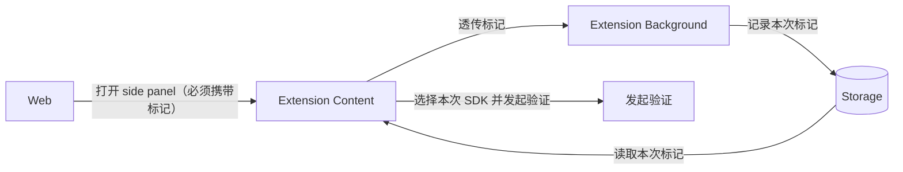

# 同一扩展内双 SDK 共存说明

本文档说明在**同一浏览器扩展**（ trex-extension）中，同时集成 **@reclaimprotocol/browser-extension-sdk** 与在其基础上维护的 **@trexproxy/browser-extension-sdk** 的可行性及约束。为确保运行时上下文的完全隔离，**单次证明会话（Proof Session）需遵循严格的互斥性原则**，即系统仅允许依据配置激活并使用其中一套 SDK。

---

## 1. 可行性与前提

**可以共存。** 同一扩展内同时加载两套 Reclaim 风格 SDK 在技术上是可行的，需满足：
- **@reclaimprotocol/browser-extension-sdk 无需改动**
- **命名与资源隔离**：@trexproxy/browser-extension-sdk 在消息类型、存储键、脚本与资源路径等方面与 @reclaimprotocol/browser-extension-sdk 完全隔离。
- **Offscreen 生命周期互斥管理**：鉴于 Manifest V3 (MV3) 架构限制全局仅允许单一 Offscreen Document 实例，Fork 侧需实施严格的“用即创建、用完销毁”策略，通过主动释放资源确保与 Reclaim 侧的执行时序互不冲突（详见 2.2 节）。


---

## 2. Fork 侧改动清单（命名与资源隔离 + Offscreen 共存）

本节详述 Fork 侧的具体改造方案，包含代码修改位置与具体实现逻辑。`trexExtensionSDK` 用法与 `reclaimExtensionSDK` 保持一致，但需严格遵守互斥使用原则。

### 2.1 命名与资源隔离

#### 2.1.1 npm 包名

避免与官方包依赖冲突。

**文件**：`trex-proxy-browser-extension-sdk/package.json`

将 `name` 字段改为 `"@trexproxy/browser-extension-sdk"`：

```
"name": "@trexproxy/browser-extension-sdk",
```


#### 2.1.2 消息 / Action 类型

避免两套 SDK 的 `onMessage` 处理同一消息。

**文件**：`trex-proxy-browser-extension-sdk/src/utils/constants/interfaces.js`

1. **RECLAIM_SDK_ACTIONS、MESSAGE_ACTIONS**：各 value 统一加前缀 `TREX_SDK_`。示例（原值 → 改后）：

   CHECK_EXTENSION: `"RECLAIM_EXTENSION_CHECK"` → `"TREX_SDK_EXTENSION_CHECK"`  
   EXTENSION_RESPONSE: `"RECLAIM_EXTENSION_RESPONSE"` → `"TREX_SDK_EXTENSION_RESPONSE"`  
   …  
   START_VERIFICATION: `"START_VERIFICATION"` → `"TREX_SDK_START_VERIFICATION"`

   其余枚举项请按同理规则逐一进行前缀替换。

2. **MESSAGE_SOURCES**：为了双重保险，建议将 `manifest.json` 无关的内部通信 Source 值也做区分。

   CONTENT_SCRIPT: `"content-script"` → `"trex-content-script"`
   BACKGROUND: `"background"` → `"trex-background"`
   OFFSCREEN: `"offscreen"` → `"trex-offscreen"`


#### 2.1.3 Storage key

避免两套 SDK 共用同一 key 导致数据互相覆盖。

涉及文件（均需将 storage key 改为 `trex_sdk_` 前缀）：

- `trex-proxy-browser-extension-sdk/src/utils/logger/constants.js` — 定义 `LOG_CONFIG_STORAGE_KEY`
- `trex-proxy-browser-extension-sdk/src/utils/logger/LoggerService.js` — 使用 `LOG_CONFIG_STORAGE_KEY` 与字面量 `reclaim_device_id`
- `trex-proxy-browser-extension-sdk/src/ReclaimExtensionSDK.js` — 使用 `LOG_CONFIG_STORAGE_KEY`
- `trex-proxy-browser-extension-sdk/src/background/background.js` — 使用 `LOG_CONFIG_STORAGE_KEY`
- `trex-proxy-browser-extension-sdk/src/offscreen/offscreen.js` — 使用 `LOG_CONFIG_STORAGE_KEY`
- `trex-proxy-browser-extension-sdk/src/content/content.js` — 使用 `LOG_CONFIG_STORAGE_KEY`

**文件**：`trex-proxy-browser-extension-sdk/src/utils/logger/constants.js`

将 `LOG_CONFIG_STORAGE_KEY` 的值改为 `"trex_sdk_log_config"`：

```
export const LOG_CONFIG_STORAGE_KEY = "trex_sdk_log_config";
```

**文件**：`trex-proxy-browser-extension-sdk/src/utils/logger/LoggerService.js`

将 `reclaim_device_id` 改为 `trex_sdk_device_id`（get/set 两处）：

```
const result = await chrome.storage.local.get(["trex_sdk_device_id"]);
...
await chrome.storage.local.set({ trex_sdk_device_id: this.deviceId });
```

其余 4 个文件（ReclaimExtensionSDK.js、background.js、offscreen.js、content.js）仅通过 `LOG_CONFIG_STORAGE_KEY` 引用，改 constants 后即生效，无需改 key 字面量。

#### 2.1.4 构建输出与扩展内路径

避免与 Reclaim 共用同一脚本/资源路径。两件事：

**1）Fork 构建产物放到宿主扩展的哪个目录**

Fork 执行 `npm run build` 后，把 `trex-proxy-browser-extension-sdk/build/` 下的全部内容拷贝到宿主扩展的 **`trex-extension/public/trex-browser-extension-sdk/`**。这样扩展内加载的 URL 为 `trex-browser-extension-sdk/xxx`，与 Reclaim 的 `reclaim-browser-extension-sdk/xxx` 区分开。

**推荐配置自动化脚本**：在 `package.json` 中配置如下命令以简化流程：

```json
"scripts": {
  "build:to-host": "npm run build && mkdir -p ../trex-extension/public/trex-browser-extension-sdk && cp -r build/* ../trex-extension/public/trex-browser-extension-sdk/"
}
```

**2）Fork 代码里扩展资源路径前缀**

**文件**：`trex-proxy-browser-extension-sdk/webpack.config.js`  
当前 `output.path` 为 `build`，可保持不变；若希望构建目录名即 `trex-browser-extension-sdk`，可改为 `build/trex-browser-extension-sdk`，并相应改 CopyWebpackPlugin 的 `to`、HtmlWebpackPlugin 的产出路径。

Fork 源码里所有 `chrome.runtime.getURL("reclaim-browser-extension-sdk/...")` 或类似路径，一律改为 **`trex-browser-extension-sdk/...`**（例如 offscreen 见 2.2 步骤 1）。

#### 2.1.5 Content script 注册（宿主扩展）

同一页面下两套 content 须使用不同 id 与路径。

在 `trex-extension/src/pages/background/index.ts`（或宿主项目的 Content Script 注册入口）增加新条目注册：设定 id 为 `trex-sdk`，指定 js 路径为 `trex-browser-extension-sdk/content/content.bundle.js`。即使可通过 `chrome.scripting.registerContentScripts` 动态注册，仍建议优先在 `manifest.json` 的 `content_scripts` 字段中静态声明。

#### 2.1.6 Background 双初始化（宿主扩展）

在保留原有 `reclaimExtensionSDK.initializeBackground()` 调用的基础上，**新增**如下逻辑：引入 Fork 包并再次执行 background 初始化过程。

**文件**：`trex-proxy-browser-extension-sdk/src/ReclaimExtensionSDK.js`

将导出的单例名由 `reclaimExtensionSDK` 改为 `trexExtensionSDK`：

```
export const trexExtensionSDK = new ReclaimExtensionSDK();
```

**文件**：`trex-proxy-browser-extension-sdk/src/types/index.d.ts`

同上，声明改为：

```
export const trexExtensionSDK: ReclaimExtensionSDK;
```

**文件**：`trex-extension/src/pages/background/index.ts`

新增 import 与一行初始化调用（原有 `reclaimExtensionSDK.initializeBackground()` 保留）：

```
import { trexExtensionSDK } from "@trexproxy/browser-extension-sdk";
...
trexExtensionSDK.initializeBackground();
```

#### 2.1.7 导出 TrexExtensionProofRequest（Fork 包）

Fork 包对外用独立类名，扩展侧可直接 `import { TrexExtensionProofRequest }`，无需 as 别名。

**文件**：`trex-proxy-browser-extension-sdk/src/ReclaimExtensionSDK.js`（export 区）

改为以别名导出：

```
export { ReclaimExtensionProofRequest as TrexExtensionProofRequest };
```

**文件**：`trex-proxy-browser-extension-sdk/src/types/index.d.ts`

在 `ReclaimExtensionProofRequest` 类定义后增加一行导出；将 `ReclaimExtensionSDK` 的 `init`、`fromJsonString` 返回类型改为 `TrexExtensionProofRequest`：

```
export { ReclaimExtensionProofRequest as TrexExtensionProofRequest };

export class ReclaimExtensionSDK {
  ...
  init(...): Promise<TrexExtensionProofRequest>;
  fromJsonString(...): TrexExtensionProofRequest;
}
```

#### 2.1.8 发起验证时选用哪套 SDK（content 页）

**文件**：`trex-extension/src/pages/content/index.tsx`

**import 区（约第 17–19 行）**：保留 Reclaim，并增加 Trex（Fork 包按 2.1.7 导出后可直接引入）。

新增一行：

```
import { TrexExtensionProofRequest } from "@trexproxy/browser-extension-sdk";
```

**使用处（约第 287 行）**：用 Trex 时 `new TrexExtensionProofRequest()`，用 Reclaim 时 `new ReclaimExtensionProofRequest()`。

### 2.2 Offscreen 资源抢占与生命周期管理

Manifest V3 (MV3) 架构规定,扩展程序软件包可以包含多个Offscreen Document, **全局同一时刻仅允许存在一个 Offscreen Document**（[官方文档](https://developer.chrome.com/docs/extensions/reference/api/offscreen)）。为此，必须建立明确的资源竞争与清理机制：

- **Trex SDK (Fork) 策略**：实施**抢占式生命周期管理**。
    1.  **抢占 (Preempt)**：在尝试创建 Offscreen 环境前，强制关闭任何现存的 Offscreen Document，确保获得干净的执行环境。
    2.  **释放 (Release)**：在证明任务完成（或失败）后，立即主动销毁 Offscreen Document，将全局槽位腾空。
- **Reclaim SDK (Original) 策略**：维持原生逻辑（被动兼容）。由于 Trex SDK 会在使用后清理现场，Reclaim SDK 在后续运行时将按需自行创建环境，不受干扰。

#### 2.2.1 指定独立 Offscreen 资源路径

**文件**：`trex-proxy-browser-extension-sdk/src/utils/offscreen-manager.js`

将 `createOffscreenDocumentInternal` 方法中加载的 HTML 路径修正为 Fork 包的独立路径：

```javascript
"trex-browser-extension-sdk/offscreen/offscreen.html",
```

宿主中该 URL 对应文件：`trex-extension/public/trex-browser-extension-sdk/offscreen/offscreen.html`。

#### 2.2.2 创建前清理既有 Offscreen 环境

**文件**：`trex-proxy-browser-extension-sdk/src/utils/offscreen-manager.js`

在 `ensureOffscreenDocument` 方法中（约第 242–256 行），修改对已存在 Context 的处理逻辑。不再复用，而是强制销毁并重建：

```javascript
    if (contexts.length > 0) {
      await chrome.offscreen.closeDocument();
      offscreenReady = false;
    }
```

（移除该分支内的返回语句，确保流程能够通过穿透（Fall-through）机制执行后续的 `createOffscreenDocumentInternal()` 逻辑。）

#### 2.2.3 实现任务结束后的资源释放

**文件**：`trex-proxy-browser-extension-sdk/src/utils/offscreen-manager.js`

封装并导出资源销毁函数 `closeOffscreenDocument()`：内部调用 `chrome.offscreen.closeDocument()`（需容错处理），并重置模块状态 `offscreenReady = false`。

**文件**：`trex-proxy-browser-extension-sdk/src/utils/proof-generator/proof-generator.js`

在 `generateProof` 的完成回调中注入销毁逻辑：
在 `resolve(response)` 之前，调用 `closeOffscreenDocument()`。确保无论证明生成成功与否，Offscreen 资源均被释放。

*可选优化*：若采用队列机制，亦可在 `processNextQueueItem` 的 `finally` 块中统一执行销毁，以覆盖所有异常路径。

#### 2.2.4 宿主 Manifest 资源声明

**文件**：`trex-extension/manifest.json`

在 `web_accessible_resources[0].resources` 中，在现有 `reclaim-browser-extension-sdk/...` 条目后新增与之一一对应的 `trex-browser-extension-sdk/` 条目：

```
"trex-browser-extension-sdk/offscreen/offscreen.html",
"trex-browser-extension-sdk/offscreen/offscreen.bundle.js",
"trex-browser-extension-sdk/interceptor/network-interceptor.bundle.js",
"trex-browser-extension-sdk/interceptor/injection-scripts.bundle.js",
"trex-browser-extension-sdk/content/components/reclaim-provider-verification-popup.css",
"trex-browser-extension-sdk/content/components/reclaim-provider-verification-popup.html",
```

---

## 3. Web 客户端发起定向 SDK 调用方案

目标：建立从 Web 端到 Extension Content 再到 Background 的完整参数透传链路。当 Web 侧触发“打开 side panel”操作时，携带特定标记指定 SDK 版本。扩展侧根据该标记在发起验证时动态实例化对应的 SDK 类；若无标记，则默认回退至 Reclaim SDK 逻辑。



### 3.1 Web 侧发送参数

**文件**：`trex-website/apps/trex-site/components/portal/questV2/QuestItemList.tsx`

在 `window.postMessage` 的 `payload` 中新增字段 `proofRequestSdk`，其值应设定为明确的常量标识符，用于激活 Trex Fork SDK：

```ts
window.postMessage({
  type: "trex_extension_open_side_panel",
  payload: { proofRequestSdk: "trexproxy_browser_extension_sdk_fork_v1" },
});
```

### 3.2 Content 侧透传 payload 到扩展消息

**文件**：`trex-extension/src/pages/content/index.tsx`

当前该分支里把 `payload` 写成了 `event.data.data`。改为透传 `event.data.payload`：

```ts
chrome.runtime.sendMessage({
  type: EMessageType.OpenSidePanel,
  payload: event.data.payload,
});
```

### 3.3 Background 侧记录本次选择（供 content 发起验证读取）

**文件**：`trex-extension/src/pages/background/index.ts`

在 `chrome.runtime.onMessage.addListener` 的 `EMessageType.OpenSidePanel` 分支内，在 `sendResponse` 前增加一行写入本次选择（storage key 名固定为 `trex_selected_proof_request_sdk`；未传则写入 `undefined`，不影响旧逻辑）：

```ts
await chrome.storage.local.set({
  trex_selected_proof_request_sdk: message.payload?.proofRequestSdk,
});
```

（该分支现有逻辑 `chrome.sidePanel.open(...)` 保留。）

### 3.4 发起验证处按选择创建 ProofRequest

**文件**：`trex-extension/src/pages/content/index.tsx`

在发起验证的地方（当前为 `const request = new TrexExtensionProofRequest();`），改为先读 `trex_selected_proof_request_sdk`，只有命中常量才走 Trex Fork SDK，否则走 Reclaim（默认不传不改旧逻辑）：

```ts
const { trex_selected_proof_request_sdk } = await chrome.storage.local.get(
  "trex_selected_proof_request_sdk",
);
const request =
  trex_selected_proof_request_sdk === "trexproxy_browser_extension_sdk"
    ? new TrexExtensionProofRequest()
    : new ReclaimExtensionProofRequest();
```

**重要提示**：当前 `ReclaimExtensionElement` 采用 `useEffect(() => { new ... }, [])` 模式，即组件加载时立即实例化。为确保严格响应 Web 侧的选择，需将实例化逻辑重构为异步触发，即在完成 `trex_selected_sdk` 的读取判定后，再执行 `new ProofRequest` 操作（需相应调整同文件内的依赖与触发时机）。
