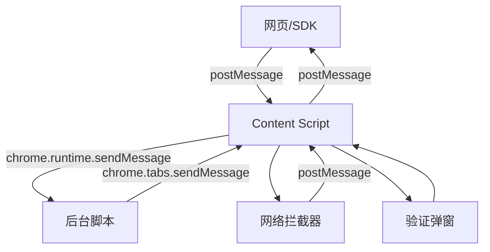

# Content Script 模块

Content Script 模块负责在网页上下文中运行，并处理 Reclaim 浏览器扩展的核心功能。它充当网页、Reclaim SDK 和扩展后台脚本（Background Scripts）之间的桥梁。

## 📁 目录结构

```
src/content/
├── content.js              # 主 content script 入口点
├── components/             # UI 组件
│   └── ProviderVerificationPopup.js  # 验证弹窗 UI
└── README.md              # 本文档
```

## 🔧 核心功能

### 1. 网络拦截与过滤

Content Script 与网络拦截器（Network Interceptor）协同工作，根据特定于提供商（Provider）的标准捕获并过滤 HTTP 请求/响应。

**主要特性：**

- 通过注入的拦截器脚本拦截网络请求和响应
- 根据提供商配置过滤请求
- 将请求与其对应的响应进行关联
- 管理被拦截数据的内存清理
- 一旦找到所有必需的请求，自动停止收集

### 2. 提供商验证弹窗

这是一个复杂的 UI 组件，通过实时状态更新引导用户完成验证过程。

**特性：**

- 位于页面右下角的响应式弹窗
- 带有进度指示的多步验证流程
- 实时状态更新（凭证创建、证明生成、提交）
- 错误处理和重试机制
- 具有动画效果的现代玻璃拟态（Glassmorphism）设计

### 3. SDK 通信桥梁

促进运行在网页上的 Reclaim SDK 与扩展后台脚本之间的通信。

**支持的操作：**

- 扩展检测和健康检查
- 启动验证流程
- 实时状态更新
- 证明（Proof）投递

## 🚀 集成指南

### 在您的扩展中设置 Content Script

1. **Manifest 配置** (manifest.json):

```json
{
  "content_scripts": [
    {
      "matches": ["<all_urls>"],
      "js": ["content/content.bundle.js"],
      "run_at": "document_start",
      "all_frames": false
    }
  ]
}
```

2. **必需的依赖项**:

- 网络拦截器脚本（必须是 web-accessible 的）
- 用于消息处理的后台脚本
- 提供商配置数据
- 日志服务

### 环境变量

确保在构建期间设置了这些环境变量：

```bash
EXTENSION_ID=your-extension-id-here
```

这用于安全验证，以确保只有您的扩展可以与 SDK 通信。

### 消息流架构



## 📨 消息操作参考

### SDK 操作 (网页 ↔ Content Script)

- `RECLAIM_EXTENSION_CHECK` - 检查扩展是否已安装
- `RECLAIM_EXTENSION_RESPONSE` - 扩展可用性响应
- `RECLAIM_START_VERIFICATION` - 开始验证流程
- `RECLAIM_VERIFICATION_STARTED` - 验证已开始确认
- `RECLAIM_VERIFICATION_COMPLETED` - 验证完成并附带证明
- `RECLAIM_VERIFICATION_FAILED` - 验证失败并附带错误

### 内部操作 (Content Script ↔ 后台脚本)

- `CONTENT_SCRIPT_LOADED` - 通知 Content Script 已准备就绪
- `SHOULD_INITIALIZE` - 检查 Content Script 是否应初始化
- `REQUEST_PROVIDER_DATA` - 请求提供商配置
- `PROVIDER_DATA_READY` - 提供商数据可用
- `SHOW_PROVIDER_VERIFICATION_POPUP` - 显示验证 UI
- `FILTERED_REQUEST_FOUND` - 找到匹配的网络请求
- `INTERCEPTED_REQUEST_AND_RESPONSE` - 网络数据已捕获

### 状态操作 (后台脚本 → Content Script)

- `CLAIM_CREATION_REQUESTED` - 凭证创建已请求
- `CLAIM_CREATION_SUCCESS/FAILED` - 凭证创建结果
- `PROOF_GENERATION_STARTED` - 证明生成开始
- `PROOF_GENERATION_SUCCESS/FAILED` - 证明生成结果
- `PROOF_SUBMITTED` - 证明已成功提交
- `PROOF_SUBMISSION_FAILED` - 证明提交失败

## 🛠️ 自定义指南

### 修改验证弹窗

位于 `components/ProviderVerificationPopup.js` 的弹窗组件可以进行自定义：

**样式**: 修改 `injectStyles()` 函数中注入的 CSS
**内容**: 更新 `renderInitialContent()` 中的 HTML 结构
**行为**: 修改针对不同验证状态的状态处理程序

**关键自定义点：**

```javascript
// 弹窗定位
bottom: 20px;
right: 20px;

// 颜色和主题
background-color: #2C2C2E;
color: #FFFFFF;

// 动画时间
transition: all 0.3s ease;
```

### 提供商配置

Content Script 期望的提供商数据结构：

```javascript
{
  providerId: "string",
  name: "提供商名称",
  description: "提供商描述",
  loginUrl: "https://provider.com/login",
  requestData: [
    {
      url: "https://api.provider.com/user",
      method: "GET",
      responseMatches: [
        {
          value: "$.user.verified",
          type: "contains",
          invert: false
        }
      ]
    }
  ]
}
```

### 网络过滤逻辑

修改 `../utils/claim-creator` 中的 `filterRequest()` 函数以自定义请求过滤逻辑：

```javascript
// 自定义过滤器示例
const customFilter = (request, criteria, parameters) => {
  // 在此处编写您的自定义过滤逻辑
  return matchesCustomCriteria(request, criteria);
};
```

## 🔒 安全注意事项

1. **扩展 ID 验证**: 始终验证扩展 ID 以防止未经授权的访问
2. **消息来源验证**: 仅接受来自同一窗口/源的消息
3. **数据清理**: 清理从网页接收的所有数据
4. **内存管理**: 使用后清除敏感数据
5. **网络数据处理**: 安全地处理拦截的网络数据

## 🐛 调试与故障排除

### 常见问题

1. **Content Script 未加载**
   - 检查 manifest.json 配置
   - 验证 content script 是否已构建且可访问
   - 检查控制台是否有注入错误

2. **网络拦截不工作**
   - 确保拦截器脚本在 manifest 中是 web-accessible 的
   - 检查脚本注入时机（应为 document_start）
   - 验证网络拦截器 bundle 是否存在

3. **弹窗未显示**
   - 在注入前检查 DOM 就绪状态
   - 验证 CSS 样式是否正确注入
   - 检查是否与宿主页面存在 CSS 冲突

4. **SDK 通信失败**
   - 验证扩展 ID 是否与环境变量匹配
   - 检查消息格式和操作名称
   - 确保正确的响应处理

### 调试日志

通过设置日志服务启用调试日志：

```javascript
import { debugLogger, DebugLogType } from "../utils/logger";

debugLogger.log(DebugLogType.CONTENT, "在这里输入您的调试信息");
```

## 🔄 扩展生命周期

1. **初始化**: Content Script 检查是否应针对当前 URL 进行初始化
2. **注入**: 如果需要初始化，则注入网络拦截器
3. **配置**: 从后台脚本请求提供商数据
4. **收集**: 拦截并过滤网络请求
5. **验证**: 显示弹窗并管理验证流程
6. **清理**: 完成或超时后清理资源

